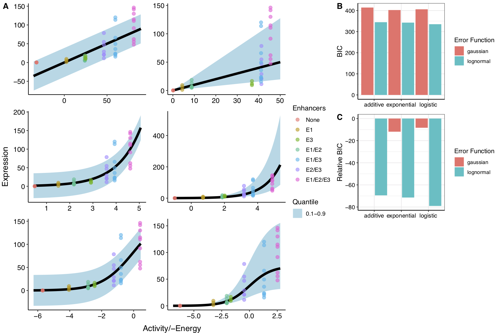

### super-enhancer-testing
Testing models of super enhancer activity using superEnhancerModelR package from Dukler, et al. (2017)  
  
##### `inputs/`
Contains example data for _wap_, _alpha-globin_, and _beta-globin_. Files in "_superEformat_" can be plugged straight into `test_superE.R`. Other files need to be reshaped by functions from `utilityfunctions_superE.R` prior to testing.  
  
##### `outputs/`
Houses files generated from testing of superEnhancerModelR, as concatenated and plotted by `compile_results.R`.  
  
##### `utilityfunctions_superE.R`
* Contains functions for generating B-globin data for testing the super enhancer model based on code from AP (2017), and expression data from Bender, et al (2012)  
* Defines functions for reshaping data into format amenable to `superEnhancerModelR` package  
* Functions for streamlining model generation using `superEnhancerModelR`  
* Personalized plotting functions adapted from the package itself  
  
##### `test_superE.R`
Command-line generation of `superEnhancerModelR` models using all combinations of Link and Error functions, returning plots of model fits and BIC/relative BIC values and a _.csv_ file of coefficients and metadata for each model.  
  
Usage:  
```
test_superE.R [-h] [-f FORMULA] [-i ITERATIONS [ITERATIONS ...]] [-ab ACTIVITYBOUNDS] [-eb ERRORBOUNDS] [-sb SCALEBOUNDS] [-lf LINKFUNCTIONS] [-ef ERRORFUNCTIONS] data outputlocation

positional arguments:
  data                  Path to data in superEnhancerModelR format as .csv
                        file.
  outputlocation        Path to directory to save outputs.

optional arguments:
  -h, --help            show this help message and exit

  -f FORMULA, --formula FORMULA
                        Formula describing enhancer interactions. Default ~E1+E2+E3+E4+E5+E6.

  -i ITERATIONS [ITERATIONS ...], --iterations ITERATIONS [ITERATIONS ...]
                        Number of iterations to perform in optimDE(). Can be list of values. Default 2000.

  -ab ACTIVITYBOUNDS, --activitybounds ACTIVITYBOUNDS
                        Activity bounds to pass to superEnhancerDataObject() function. Default [-200, 200].

  -eb ERRORBOUNDS, --errorbounds ERRORBOUNDS
                        Error parameter bounds to pass to superEnhancerDataObject() function. Default [0.001, 1000].

  -sb SCALEBOUNDS, --scalebounds SCALEBOUNDS
                        Scale parameter bounds to pass to superEnhancerDataObject() function. Default [0.001, 1000].

  -lf LINKFUNCTIONS, --linkfunctions LINKFUNCTIONS
                        Link functions to test as R vector. Default Additive, Exponential, and Logistic.

  -ef ERRORFUNCTIONS, --errorfunctions ERRORFUNCTIONS
                        Error functions to test as R vector. Default Gaussian and Log-Normal.
```
  
Generates figures containing:  
* fits of all provided Link and Error function combinations,  
* along with calculated BIC for each model,  
* and relative BIC (difference from Additive/Gaussian model)  
  
Notes:  
* Provide bounds and functions arguments as R-style vectors, e.g. `-ab "c(-500,500)"`, with quotations on command line for proper parsing
* When providing functions arguments (`-lf`, `-ef`), escape single quotation marks within the string for proper parsing, e.g. `-ef "c(\'lognormal\')"`
  
Example:  
```
Rscript test_superE.R inputs/wap_data_superEformat.csv ./ -f ~E1+E2+E3 -i 10000
```
  

